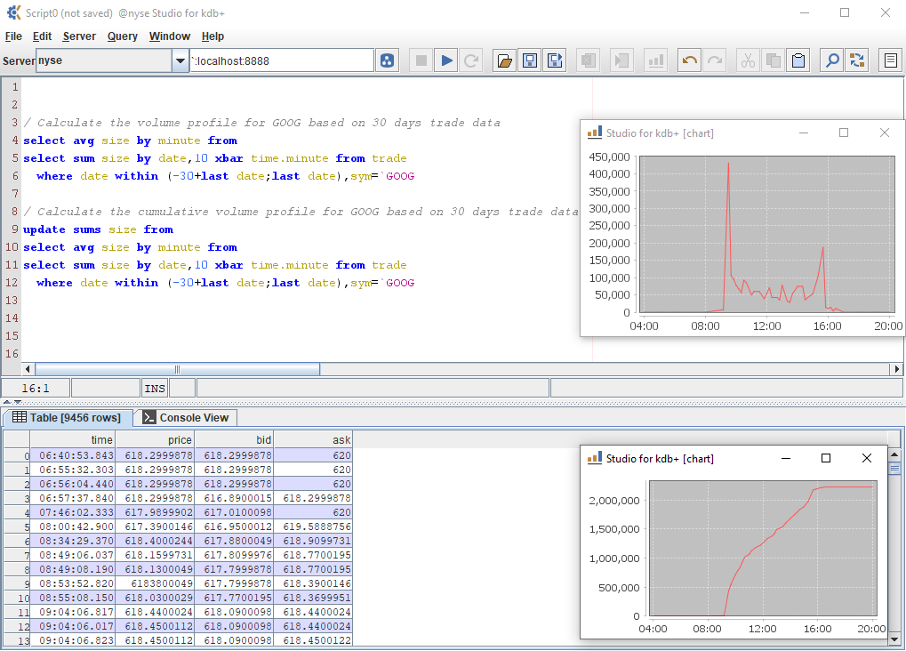

Studio for kdb+
=========

Studio for kdb+ is a rapid development environment for the **ultra-fast** database kdb+ from [Kx Systems]. In the style of commonly used SQL Clients, it allows you to

  - Connect to kdb+ processes
  - Execute selected text from the editor window
  - View results as tables, charts, or classic console style 

The editor component is based on the NetBeans editor component, and includes the following features
  - find/search/replace
  - cut/copy/paste
  - undo/redo
  - syntax highlighting for the q language
  - most recent files menu

Additionally the application features
  - export to Excel
  - drag and drop
  - immediate charting of grid data

Screenshot
---------

Credits
-----------

Studio for kdb+ uses the following open source projects:

* [NetBeans] - text editor component
* [JFreeChart] - charting component
* [Kx Systems] - kdb+ driver c.java
* [Apache] - POI for Excel export
* [Jackson] - JSON API

Installation
--------------
Click on the tags icon on the right in the "Releases" box. Expand the "Assets" section and download studio.zip. Extract to a local directory. Go to the "lib" directory inside and run kdb-studio.jar.

    javaw -jar kdb-studio.jar

On Windows, the Java installer will set it up such that double-clicking on the jar file will launch it.

Background
----------
Studio for kdb+ has been developed since October 2002, and the source was released to the kdb+ community in September 2008 as the primary developer wanted to allow the community to develop the application further.

Studio is written 100% in Java. The primary motivation for its development was to be able to comfortably access remote kdb+ processes. In time, it has become clear that it is not an IDE as such, but is better described as a rapid execution environment. One can edit text in the "scratch" window, highlight a selection and execute it against a remote kdb+ process via tcp/ip, with the results displayed as a grid or as in the classic kdb+ console.

License
-------
Apache 2, see LICENSE file in repository root.

N.B. Netbeans, JFreeChart and c.java components have their own respective licenses.

[Kx Systems]:http://www.kx.com
[Apache]:https://www.apache.org/
[Jackson]:https://github.com/FasterXML/jackson
[Netbeans]:http:///netbeans.org
[JFreeChart]:http://www.jfree.org/jfreechart/
